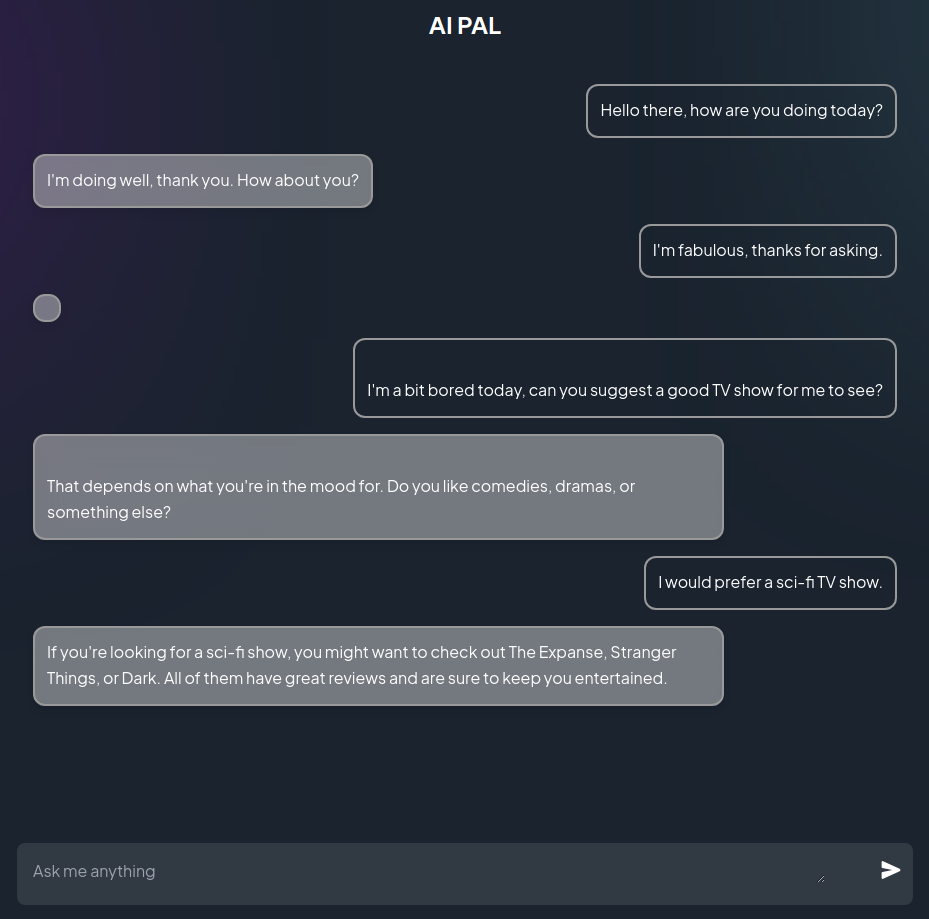

# AI PAL: ChatGPT project

AN awesome responsive online chatbot using the OpenAI Api ChatGPT model to chat in a conversational way.

## Examples

Try out the demo here: https://ai-pal-client.vercel.app/

## Tech Stack

#### Backend Stack

| Type      | Tech                                      |
| --------- | ----------------------------------------- |
| Language  | [Javascript](https://www.javascript.com/) |
| Framework | [Node](https://nodejs.org/en/)            |
| Hosting   | [Vercel](https://vercel.com/)             |
| Other     | [OpenAI](https://openai.com/)             |

#### Frontend Stack

| Type      | Tech                                                        |
| --------- | ----------------------------------------------------------- |
| Language  | [Typescript](https://www.typescriptlang.org/)               |
| Framework | [React](https://reactjs.org/) / [Vite](https://vitejs.dev/) |
| Styling   | [TailwindCSS](https://tailwindcss.com/)                     |
| Hosting   | [Vercel](https://vercel.com)                                |
